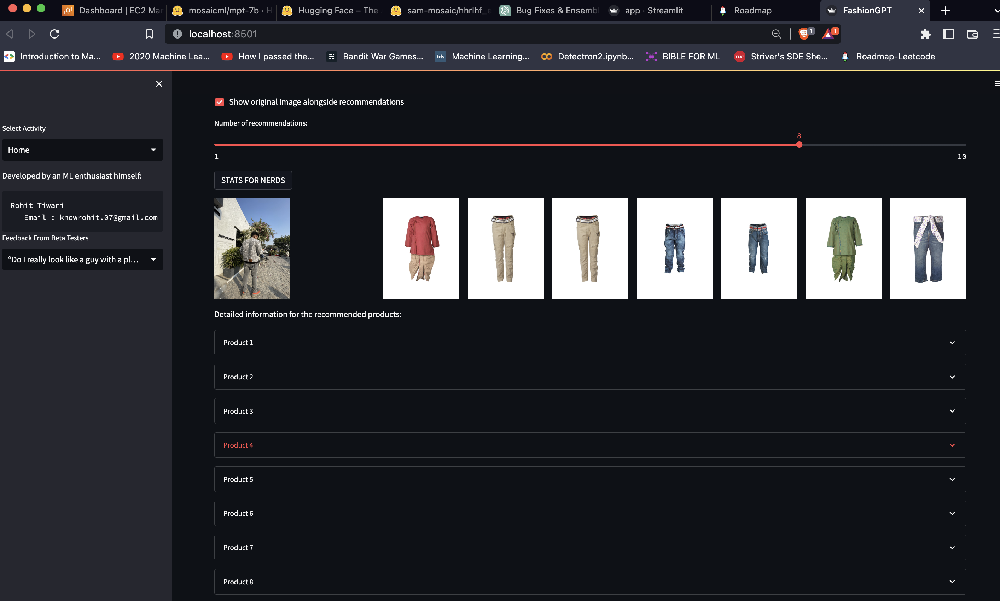
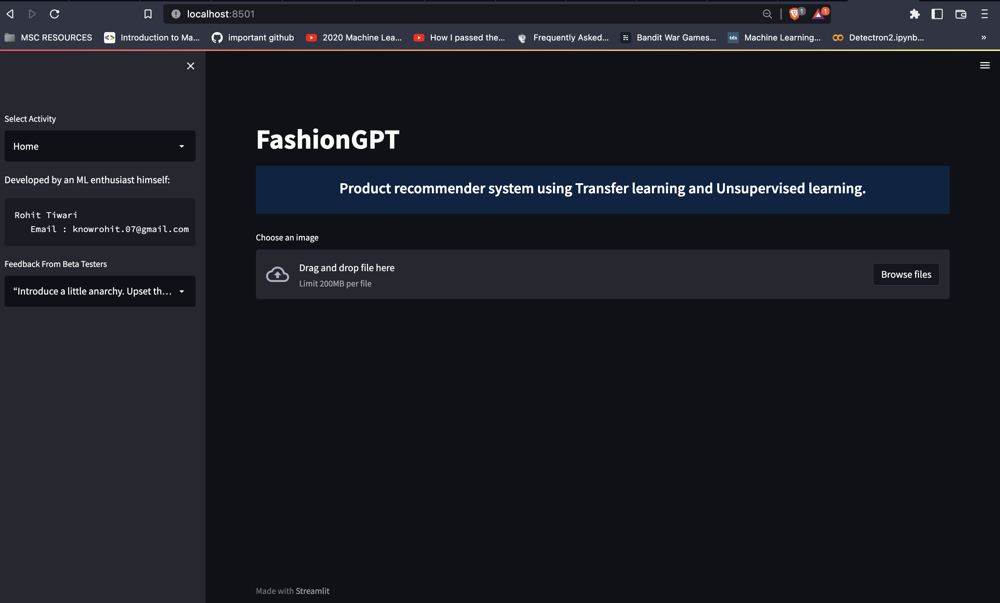
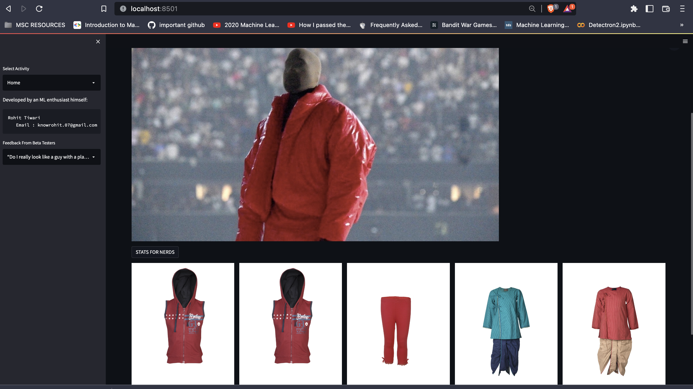
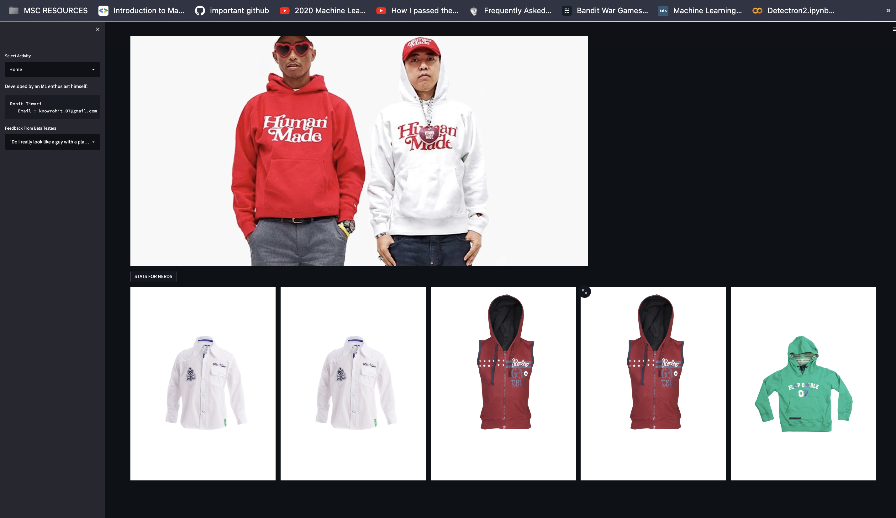
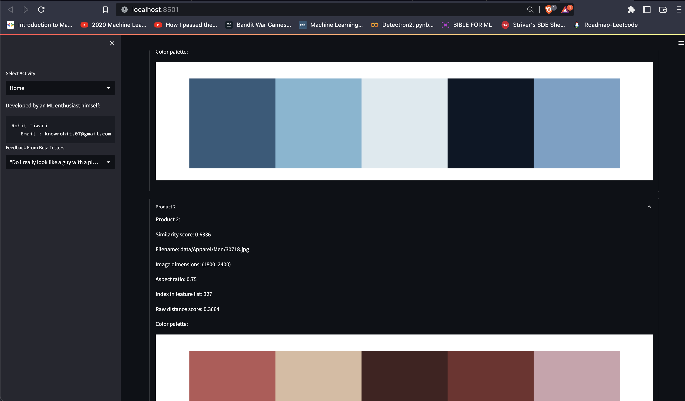

# FashionGPT: AI-Powered Fashion Recommender System & VirgilAblohGPT: Hypebeast Chatbot Assistant

Yo whats good boys! The "GPT" part is kinda part of a bigger project where ill be adding a chatbot assistant powered by GPT-NEOx as a private concierge. It will act as a guide + hype beast friend. 

 

## How it Works

FashionGPT uses a pre-trained ResNet50 model as a feature extractor to analyze the visual aspects of a user's selected image. It then compares the extracted features with a database of product images to find the most visually similar items. The Nearest Neighbors algorithm is employed to identify the top matching products based on their similarity scores. Users can choose to display the original image alongside the recommendations for easy comparison and can adjust the number of recommendations displayed. Additional product information and color palettes are also available for each recommendation.

## Main Screen
 

## Key Features

- State-of-the-art deep learning model for feature extraction
- Efficient and accurate product recommendations
- User-friendly interface for seamless interaction
- Option to display the original image alongside recommendations
- Adjustable number of recommendations
- Detailed information and color palettes for recommended products
- Wide range of supported fashion products
- Continually updated and refined to deliver the best results

## Product Recommendations

## Developer

FashionGPT is developed by a dedicated AI enthusiast and fashion aficionado, who believe in harnessing the power of technology to improve the shopping experience for users. He is committed to delivering innovative solutions that help users find their ideal fashion products with ease and accuracy.

## Stats for Nerds

## Contact Us

We would love to hear from you! If you have any questions, suggestions, or feedback, please feel free to reach out to us at knowrohit.work@gmail.com. You can also connect with us on [Twitter](https://twitter.com/knowrohit07).

## Acknowledgements

We would like to express our gratitude to the following resources and organizations for their invaluable support and contributions to the development of FashionGPT:

- [Rahul Tiwari](https://twitter.com/rahul_tiwari95) for the inspiration
